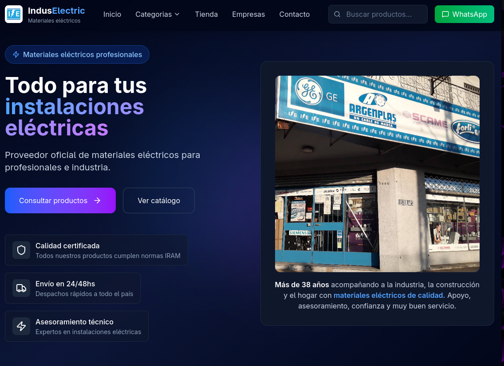
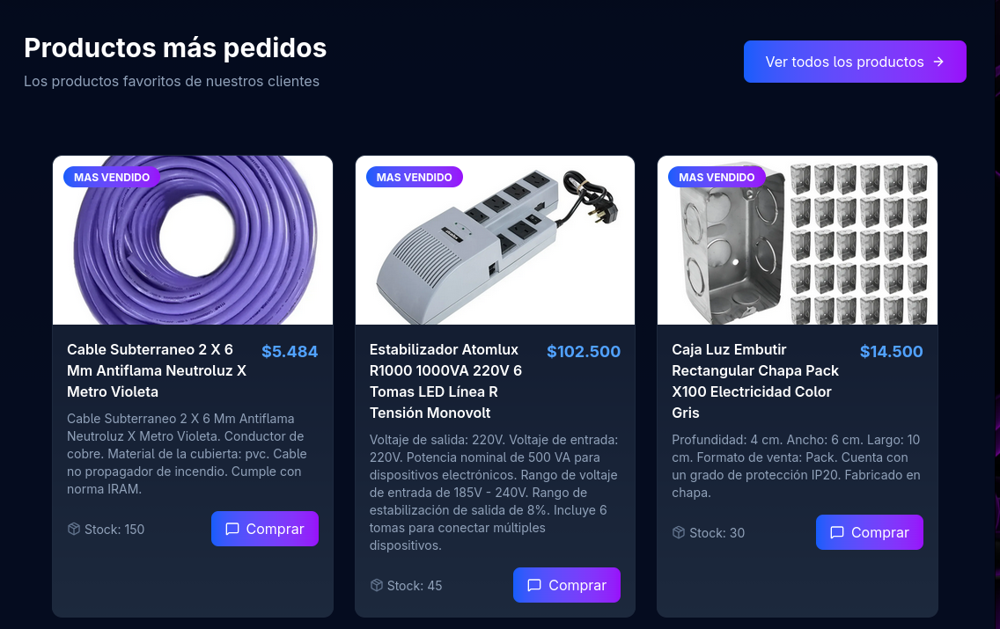
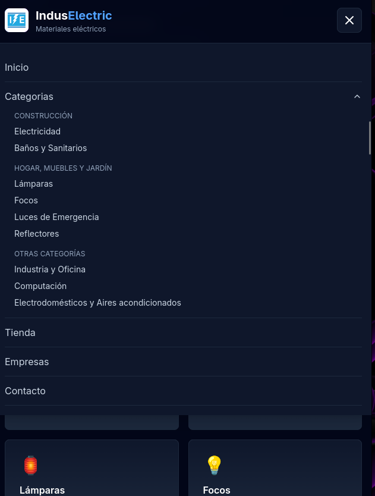
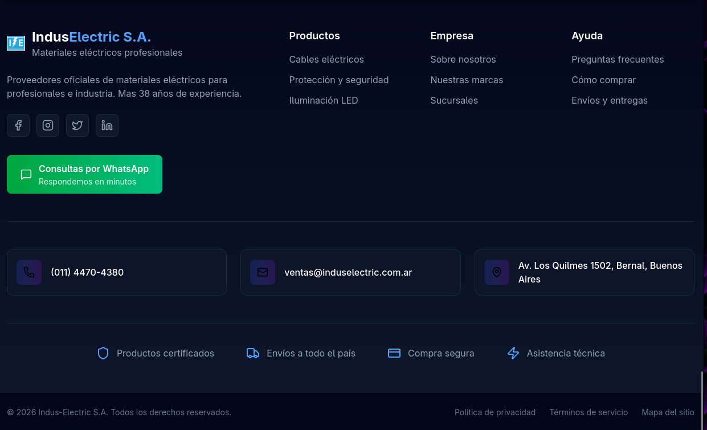
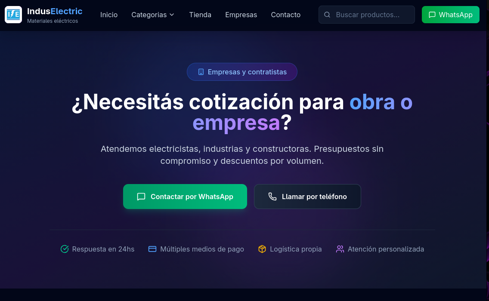

# Indus Electric – MVP Web


---

## Tabla de Contenidos

- [Descripción General](#descripción-general)
- [Tecnologías Utilizadas](#tecnologías-utilizadas)
  - [Frontend](#frontend)
  - [Infraestructura](#infraestructura)
- [Estructura del Proyecto](#estructura-del-proyecto)
- [Instalación y Ejecución](#instalación-y-ejecución)
  - [Requisitos Previos](#requisitos-previos)
  - [Clonar Repositorio](#clonar-repositorio)
  - [Configurar Variables de Entorno](#configurar-variables-de-entorno)
  - [Ejecutar Proyecto](#ejecutar-proyecto)
- [Capturas de Pantalla](#capturas-de-pantalla)

---

## Descripción General

Este proyecto es un **MVP web** desarrollado para **Indus Electric S.A.**, una empresa con más de **38 años de experiencia** en la venta de materiales eléctricos para la industria, la construcción y el hogar.

El objetivo del proyecto es contar con una **presencia digital moderna**, clara y funcional, permitiendo:

- Presentar la empresa y su trayectoria  
- Mostrar categorías de productos  
- Redirigir a la tienda oficial en MercadoLibre  
- Facilitar el contacto vía WhatsApp  

El MVP fue pensado para **validación con el cliente**, con una arquitectura simple, escalable y lista para futuras mejoras como pagos online, backend y gestión de stock.

---

## Tecnologías Utilizadas

### Frontend
- **React** – Librería principal para la construcción de la interfaz
- **Vite** – Herramienta de build rápida y liviana
- **Tailwind CSS** – Estilos modernos y diseño responsive
- **Framer Motion** – Animaciones y transiciones
- **Lucide React** – Íconos SVG

### Infraestructura
- **Node.js** – Entorno de ejecución
- **Vercel** – Hosting y despliegue continuo (CI/CD)
- **GitHub** – Control de versiones

---

## Estructura del Proyecto

```txt
src/
 ├─ components/
 │   ├─ Header.jsx
 │   ├─ Footer.jsx
 │   └─ ...
 ├─ pages/
 │   ├─ Home.jsx
 │   └─ ...
 ├─ assets/
 │   └─ images
 ├─ App.jsx
 ├─ main.jsx
public/
 └─ img/
```

---

## Instalación y Ejecución

### Requisitos Previos
- Node.js >= 18
- npm o yarn
- Git

---

### Clonar Repositorio

```bash
git clone https://github.com/rfmorinigo/induselectric.git
cd induselectric

### Configurar Variables de Entorno

Este proyecto **no requiere variables de entorno** para su ejecución básica.

(En futuras versiones podrían agregarse variables para backend, APIs o servicios externos).

---

### Ejecutar Proyecto

Instalar dependencias:

```bash
npm install
```

Ejecutar en modo desarrollo:

```bash
npm run dev
```

Build para producción:

```bash
npm run build
```

---

## Capturas de Pantalla

## 🖼️ Capturas de Pantalla

## 🖼️ Capturas de Pantalla

### Home / Hero


### Productos


### Menú Mobile


### Sección Institucional


### CTA de Contacto



## Despliegue

El proyecto está desplegado en **Vercel**, con integración continua desde GitHub.

Cada `push` a la rama principal genera automáticamente un nuevo despliegue.

---

## Notas Finales

Este MVP fue desarrollado con foco en:

- Simplicidad
- Claridad para el cliente
- Escalabilidad futura

Ideal como base para una **segunda fase** con funcionalidades avanzadas.
